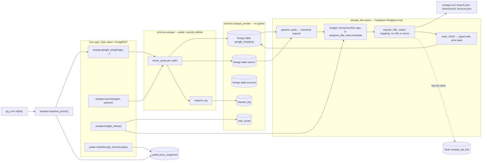

# Architecture

## Why two layers

Supabase Wrappers can only expose **foreign tables**, and Postgres cannot put row-level
security on foreign tables. A search API is a *function* (inputs → rows), not a table. So:

* The Wasm wrapper is the **engine**: it is the only custom compiled code that can run on hosted
  Supabase. It owns HTTP, the Vault key, canonical parameters (so repeats hit SerpApi's free
  one-hour cache), typed parsing, pagination, and the account-wide credit cap. Its foreign tables
  live in `serpapi_private`, which nobody is granted.
* The SQL layer is the **interface**: generated `security definer` functions with named arguments
  and defaults, a per-caller daily quota, a request log, and the snapshot ledger. It is the only
  thing an app or PostgREST ever touches.

## Request flow for `select * from serpapi.google_shopping('boAt Airdopes 141')`

1. The function checks the caller's daily quota (`serpapi_private.check_quota`).
2. It queries the private foreign table with every parameter column bound (`f.q = 'boAt…'`,
   `f.gl = ''`, `f.pages = 1`, …). Unset arguments are passed as `''` / `-1` / `false`.
3. The wrapper's `begin_scan` reads those quals, rejects anything that is not `=` (or `IN` on `q`),
   fills unset values from the server's `default_*` options, and errors if `q` is missing.
4. It loads the budget from the wrapper metadata, fails closed at the hourly or monthly cap,
   then issues `GET /search.json?engine=google_shopping&gl=in&…&json_restrictor=…&api_key=<vault>`.
5. Status codes are mapped by hand (401, 429, 400, 5xx) into messages that never include the URL.
   An empty result is zero rows plus a `NOTICE`, and still counts as a credit.
6. `iter_scan` emits one row per `shopping_results` element, echoing every parameter column
   back verbatim so Postgres' local recheck passes, plus `search_id`, `page`, typed columns, `raw`.
7. The function logs engine, params, row count and elapsed time to `serpapi_private.request_log`.

## Free re-reads

Every row carries `search_id`. `serpapi.replay_google_shopping('<id>')` (or `WHERE search_id = …`
on the private table) fetches `/searches/<id>.json` from SerpApi's archive: free for 31 days and
not counted by the wrapper's budget. The nightly ledger stores the id with every price, so the
whole demo can be replayed without spending credits.

## Where the guards live

| Guard | Layer | Why |
|---|---|---|
| `q` required, `=` only, `pages ≤ max_pages` | wrapper | before any HTTP call, regardless of caller |
| hourly / monthly account cap | wrapper metadata | protects the SerpApi account even from direct foreign-table access |
| daily per-caller quota, anon policy | `serpapi_private` tables | needs `auth.uid()` and a table |
| key never in errors | wrapper | host's `error_for_status` is never called; URLs are never reported |
| PostgREST timeouts | function `set statement_timeout` | the `authenticated` role's default is 8 s |
